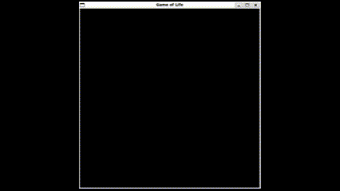

# Game_Of_Life_With-CUDA-and-MPI
The "Game of Life" is a cellular automaton devised by John Conway, consisting of a grid of cells that evolve over discrete time steps based on a set of rules. Each cell can be either alive or dead, and the state of the grid evolves according to these rules:

1) Birth: A dead cell becomes alive if it has exactly three live neighbors.
2) Survival: A live cell remains alive if it has two or three live neighbors.
3) Death by Overpopulation: A live cell dies if it has more than three live neighbors.
4) Death by Isolation: A live cell dies if it has fewer than two live neighbors.
   
These simple rules lead to complex and often unpredictable patterns, making the Game of Life a classic example of emergent behavior in mathematical systems.

As a Example of Preview : <br></br>


## Recommended Development Environment<br></br>
For this implementation of the Game of Life, I recommend using Visual Studio Code with a WSL (Windows Subsystem for Linux) environment. This setup provides a seamless Linux experience on a Windows machine, making it easier to work with libraries and tools that may not be supported natively on Windows. CUDA, in particular, runs more smoothly and efficiently in a Linux environment. You can follow this video tutorial(https://www.youtube.com/watch?v=NY5izJWXi0U) to set up VS Code with WSL.

To set up MPI in the WSL environment, you can refer to this video guide(https://www.youtube.com/watch?v=2qInO1_Gy0w). This combination of tools ensures a smoother development experience for CUDA and MPI-based applications in C.

## Implementation Steps for the Game of Life
Follow these steps to implement the Game of Life using CUDA and MPI:

 1) **Compile the CUDA File**: First, compile the CUDA source file ````game_of_life_with_cuda.cu```` to create the object file. Use the following command:
```bash
nvcc -ccbin /usr/bin/gcc-9 -c game_of_life_with_cuda.cu -o game_of_life_with_cuda.o
```
 2) **Compile the MPI File**: Next, compile the MPI source file ````mpi_part.c````, which includes the parallel processing commands. Use this command to generate the object file:
```bash
mpicc -c mpi_part.c -o mpi_part.o
```
 3) **Link the Object Files**: After compiling both files, you should have the ````game_of_life_with_cuda.o```` and ````mpi_part.o```` files in the specified directory. Now, create the final executable by linking these object files together. Use the following command:
```bash
mpicc game_of_life_with_cuda.o mpi_part.o -o final_one -L/usr/local/cuda/lib64 -lcudart -lSDL2 -lstdc++
```
This command generates the ````final_one```` executable file, which is a complete version of your program that leverages both CUDA for GPU acceleration and MPI for parallel computing.

 4) Run the Final Executable: Finally, run the ````final_one```` executable using the specified number of parallel processes. For example, to use 4 processes with MPI, use this command:
```bash
mpirun -np 4 ./final_one
```
This will execute your CUDA and MPI-based Game of Life program, utilizing both the GPU and message-passing capabilities for efficient parallel computation.
